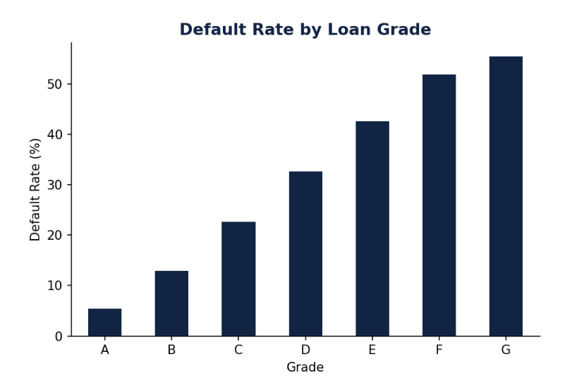
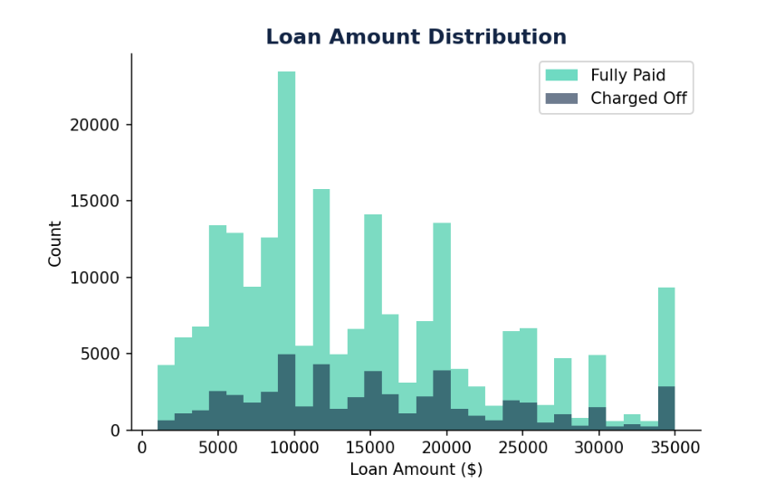
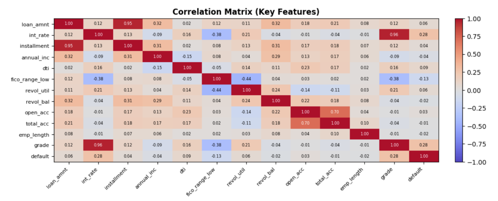
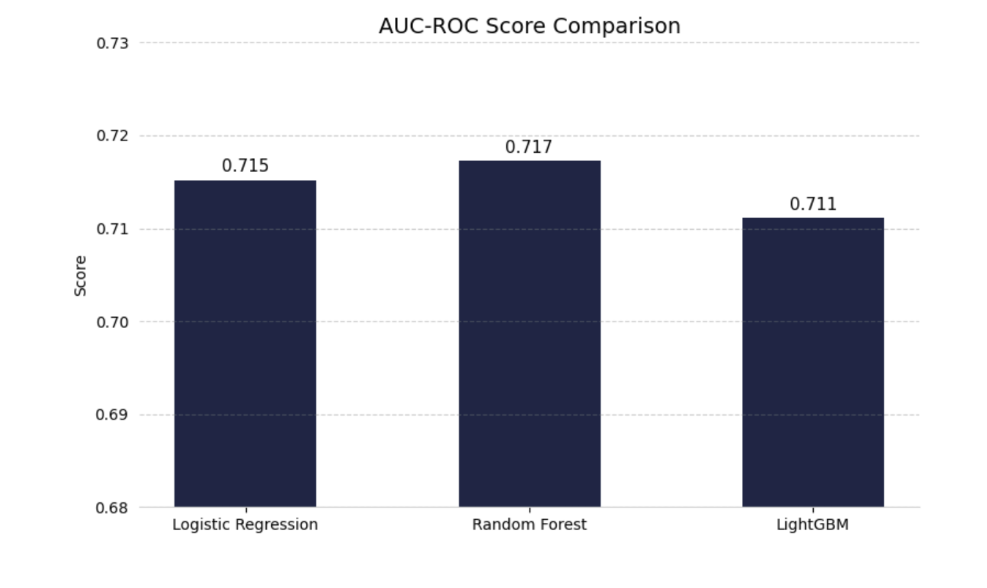
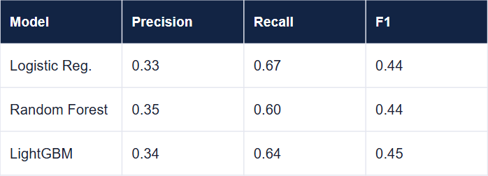

# flit.ai

Credit Risk Assistant built to improve financial literacy across all demographics.

A machine learning application that predicts the probability of a borrower defaulting on a loan using financial and credit profile data. Built on a LightGBM model trained on over 89,000 LendingClub loans, it provides instant risk assessments to improve financial literacy for those navigating important credit decisions.

**Built by:** Joseph Salvador, Fenet Diriba, Lisha Nishat — Group 14C  
**Course:** AI4ALL Ignite Accelerator

---

## Overview

Borrowers often lack transparency into why they are flagged as high risk. This tool takes application-time financial data and returns a default probability score, helping users understand their credit standing before applying for a loan.

---

## Exploratory Data Analysis

### Default Rate by Loan Grade
LendingClub assigns grades A–G to each loan. Default rate climbs steadily from Grade A (5.4%) to Grade G (55.4%), confirming the grading system aligns with real outcomes — but also revealing circular signal the model partially re-learns.



### Loan Amount Distribution
Defaults occur proportionally across all loan sizes, confirming loan amount alone is not a reliable predictor of default risk.



### Correlation Matrix
Most features have near-zero correlation with default individually, explaining the ~0.71 AUC ceiling across all models. Key findings:
- `int_rate` ↔ `grade`: **0.96** — nearly identical, both encode LendingClub's own risk assessment
- `loan_amnt` ↔ `installment`: **0.95** — mathematically redundant
- `fico_range_low` ↔ `default`: **-0.13** — strongest independent predictor



---

## Models

Three models were trained and evaluated on 89,857 resolved loans (70/30 stratified split):

### AUC-ROC Comparison


### Default Class Metrics


| Model | AUC-ROC | Precision | Recall | F1 | Accuracy |
|---|---|---|---|---|---|
| Logistic Regression | 0.715 | 0.33 | 0.67 | 0.44 | 0.65 |
| Random Forest | 0.717 | 0.35 | 0.60 | 0.44 | 0.68 |
| **LightGBM** | **0.711** | **0.34** | **0.64** | **0.45** | **0.67** |

**LightGBM was selected** for deployment due to its native SHAP compatibility, fast inference, and compact `.lgb` model file — not because it scored highest on any single metric.

---

## Dataset

Download from Kaggle: https://www.kaggle.com/datasets/wordsforthewise/lending-club

Use `accepted_2007_to_2018Q4.csv`. The app runs from the saved model file and does not require the dataset at runtime. To retrain, run the notebooks in order.

> **Note:** The model was trained exclusively on accepted loans, introducing survivorship bias — rejected applicants were excluded because their outcomes are unobservable.

---

## Project Structure

```
credit-risk-assistant/
├── notebooks/
│   ├── 01_data_cleaning.ipynb
│   └── 02_model_training.ipynb
├── assets/                          ← EDA and evaluation charts
├── static/
│   └── index.html                   ← Frontend UI
├── app.py                           ← FastAPI backend
├── credit_risk_model.lgb            ← Trained LightGBM model
├── credit_risk_model_metadata.json  ← Feature list and threshold
├── requirements.txt
└── .gitignore
```

---

## Run the App

```bash
pip install -r requirements.txt
uvicorn app:app --reload
```

Then open http://127.0.0.1:8000 in your browser.

---

## Tech Stack

- **Model:** LightGBM
- **Backend:** FastAPI, Uvicorn
- **Data:** pandas, scikit-learn
- **Language:** Python
